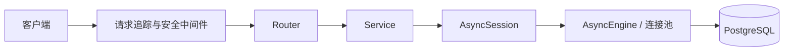

# 架构说明

## 请求调用链



Router 负责 HTTP 输入输出，Service 负责业务规则与数据库操作，ORM 描述表结构。Service 接收普通 `AsyncSession`，不依赖 FastAPI 的 `Depends`。

## Session 依赖注入

`app/db/session.py` 创建每进程共享的 Engine 和 Session 工厂：

```python
session_factory = async_sessionmaker(
    engine,
    expire_on_commit=False,
    autoflush=False,
)


async def get_db_session() -> AsyncIterator[AsyncSession]:
    async with session_factory() as session:
        yield session
```

`app/api/dependencies.py` 把它包装为路由可直接声明的类型：

```python
DbSession = Annotated[AsyncSession, Depends(get_db_session)]
```

每个请求得到独立 Session，请求结束后自动关闭。依赖只管理生命周期；写操作的 `commit()`、`rollback()` 由 Service 明确控制。

## 中间件顺序

```text
RequestIdMiddleware
  └─ CORSMiddleware
      └─ UnexpectedErrorMiddleware
          └─ BodySizeLimitMiddleware
              └─ FastAPI Router
```

- request_id 标识整次请求，并写入 `X-Request-ID` 响应头。
- CORS只允许配置中的浏览器前端源，并向前端暴露`X-Request-ID`。
- error_id 只在未知异常发生时生成，用于定位一次具体故障。
- 请求体超限直接返回 413。
- 未知异常的完整 traceback 写入服务端日志，客户端只收到安全错误信息。

## 统一响应与全局异常

业务Router使用`ApiResponse.success()`构造成功响应。预期失败分成三类：

- `BusinessException`：账号冲突、资源不存在等业务失败；
- `StarletteHTTPException`：主动HTTP错误以及框架产生的404、405；
- `RequestValidationError`：请求体、Query和Path未通过Pydantic校验。

这三类由FastAPI异常处理器转换为统一的`code/message/data`。未被处理的Bug或数据库异常继续向外
传播，由`UnexpectedErrorMiddleware`记录完整堆栈，返回安全的500、request_id和error_id。

```text
预期错误 → 对应异常处理器 → 统一4xx响应
未知错误 → UnexpectedErrorMiddleware → 日志完整堆栈 + 安全500响应
```

健康检查是给负载均衡器和运维系统使用的基础设施接口，保留简单的`status`结构，不强制套业务响应。

## 生命周期


lifespan 不运行 DDL 或 Alembic。数据库结构只能通过显式迁移命令修改。

## Alembic 护栏

`models/__init__.py` 必须显式导入每个 Model。`alembic_guard.py` 在 `--autogenerate` 时检查 metadata 是否为空，避免忘记导入 Model 后生成删除全部表的迁移。
